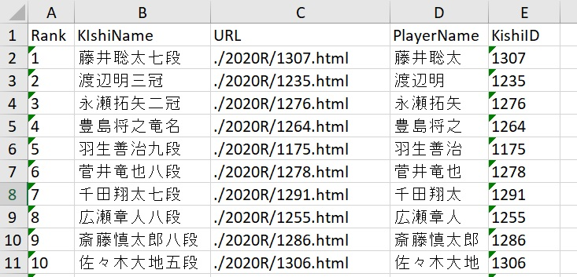
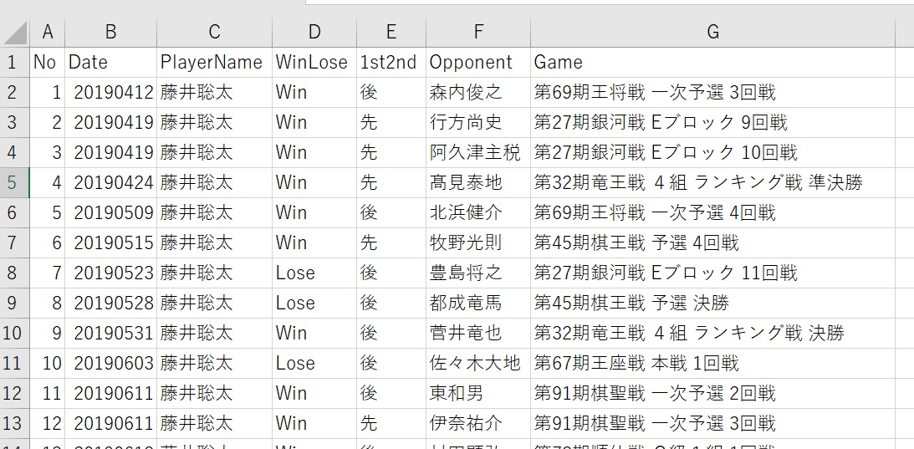

# RFE_Scraping_ShogiData
RPA(UiPath)で将棋データ（対局結果）のスクレイピング

## 概要
RPAソフトウェアのUiPathのREFramework（Robotic Enterprise Framework）を使用して、将棋データ（対局結果）のスクレイピングを行う。

## 動作
1. kishibetsu.com　にアクセスし、現役棋士の対局結果データ（2007年度～2020年度）をスクレイピング
2. 保存の対象となる項目は対局年月日、棋士名、勝敗、先手後手、対局相手、棋戦名
3. スクレイピングした結果をData\Output配下のcsvファイルに保存
4. ReFramework をテンプレートとして使用
5. 新規に作成したxamlファイルは、Shogiフォルダ配下に保存
6. TransactionItemはDataRow型

## スクレイピングしたデータの見本（Data\Output配下）
<ol>
<li>KIshiList.xlsx・・・取得した棋士リスト</li>

<li>棋士の年度ごとのcsvファイル（全員ではなく、上位数名分）</li>
</ol>

## システム要件
<ol>
<li>Windows 10</li>
<li>UiPath Communityエディション</li>
<li>UiPath Chrome拡張機能</li>
<li>Chromeブラウザ</li>
</ol>

## 制限事項
<ol>
<li>引退した棋士のデータはスクレイピングされない（∵棋士リストに名前がないため）</li>
<li>一部棋戦のデータは、日付欄が空欄となっている
（現時点で確認が取れたのは、ＮＨＫ杯、銀河戦）</li>
</ol>

